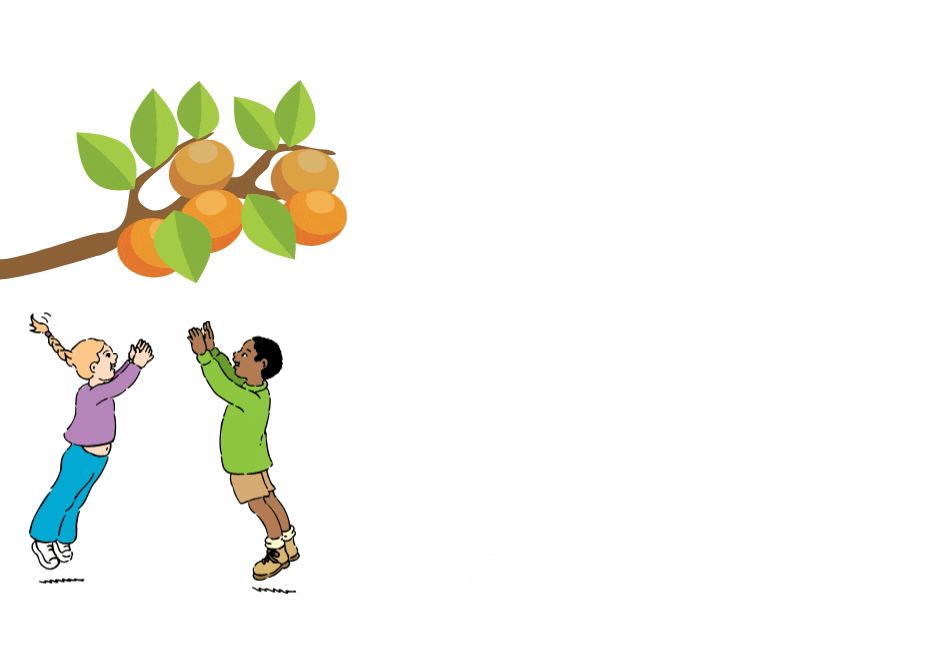

# CSS ANIMATION
### Frontend Development practice project #002 | "Only HTML and CSS. :no_entry_sign:No frameworks" CSS animation practice

## Table of contents
- [Summary](#summary)
- [Screenshot](#screenshot)
- [My process](#my-process)
  - [Built with](#built-with)
  - [What I learned](#what-i-learned)
- [Asset Links](#asset-links)
  - [SVG files](#svg-files)
- [Connect with me](#connect-with-me)
- [Acknowledgments](#acknowledgments)

## Summary

:hash: **About the project** :arrow_down:

This is a practice project of my frontend development practice project series. Where I want to gain more experience in Website Design and UI/UX Design. While doing this project I have learned and gained some clear thoughts about :ballot_box_with_check:CSS Animation property, :ballot_box_with_check:CSS Transform Porperties and also sharpen my knowledge of :ballot_box_with_check:SVG File managing with figma for the CSS Animation

## Screenshot

## My process

### Built with

- Semantic HTML5 markup
- CSS custom properties
- CSS Animation
- CSS Transform
- Desktop-first workflow
- Figma

### What I learned

I learned how to use an svg files for animation. We can choose every part of the svg and choose which part should animated or not. 

## Asset Links

### SVG Files: 
- <a href="https://freesvg.org/download/183710">Tree</a>
- <a href="https://freesvg.org/vector-graphics-of-kids-playing-handball">Kids Playing Handball </a>

## Connect with me

- Website - [Shariful Pradhan Hridoy](https://shariful-pradhan-hridoy.netlify.com/)
- Twitter - [@sharifulhridoy2](https://twitter.com/SharifulHridoy2)
- LinkedIn - [@sharifulhridoy2](https://www.linkedin.com/in/sharifulhridoy2/)
- Whatsapp - [+880 1785-018296](https://wa.me/8801785018296)
- Medium - [@sharifulpradhanhridoy](https://sharifulpradhanhridoy.medium.com/)

## Acknowledgments
I got helped from DevEd CSS Animation YouTube video, MDN, W3schools and CSS tricks.